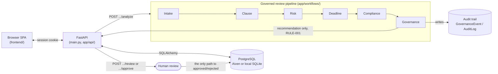

# LegalGuard AI

Agentic contract risk & compliance platform. **AI recommends, a human
decides** — nothing in this codebase can approve or reject a contract
except a lawyer, via the review endpoints. 

## Architecture



Each pipeline stage is a mock-LLM-backed agent (`app/agents/`) run through
a real `agent_framework` workflow; `app/governance/` evaluates their
output against RULE-001–008 before anything reaches the API response.

## Setup, run, test

```
uv pip install -r requirements.txt   # installs into legalenv/
python main.py                       # http://127.0.0.1:8000
uv run pytest
```

No `.env` needed to start — every setting defaults to zero-setup local
values (SQLite, mock LLM, no signing secret: sessions are opaque tokens
looked up in `user_sessions`, not JWTs). To use Postgres, copy
`.env.example` to `.env` and set `DATABASE_URL`. Tests run against
whatever database `DATABASE_URL` points at, each wrapped in a rolled-back
transaction — no separate test database, nothing persists.

Sessions slide forward on every request and lapse after
`SESSION_INACTIVITY_MINUTES` (default 180) of idleness; the cookie itself
has no expiry, so closing the browser ends the session too.

Any account can upload, analyze, and review — but only sees its own
contracts (`require_owned_contract`); another account's contract ID 404s
exactly like a nonexistent one.

## What's implemented

- FastAPI + PostgreSQL/SQLite, real bcrypt accounts, DB-backed sessions
- 5 agents (intake/clause/risk/deadline/compliance) via `agent_framework`
- Governance layer enforcing RULE-001–008, full audit trail, console +
  rotating-file logging
- Review/override endpoints, 90/30/7-day deadline checks
- Hand-styled dashboard: public homepage, login/register, contract
  upload & detail (risk gauge, compliance checklist), deadlines, audit
  trail

## What's deferred

React frontend, Entra ID auth, role-based access, Azure AI Search RAG,
Azure Functions scheduling, a real LLM provider, Docker/CI/CD, Azure
deployment — see the implementation plan for details.

## Project structure

```
main.py, config.py      entrypoint + environment-driven settings
app/
├── api/                route handlers
├── agents/             the 5 agents + shared LLM-call helper
├── workflows/          agent_framework pipeline
├── governance/         rules, evaluator, audit logging
├── llm/                chat-client seam + mock implementation
├── services/           document parsing, deadlines, auth, notifications
├── database/           models, engine/session, query helpers
├── schemas/            Pydantic models
└── logging_config.py
frontend/                static SPA, no build step
policies/                human-readable policy documents
tests/                   mirrors app/
```
